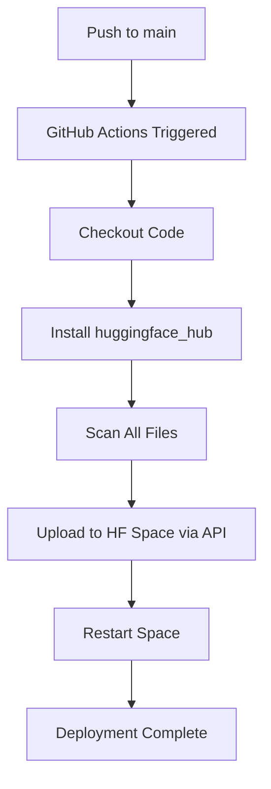

# Hugging Face Space 部署指南

本项目已配置为可自动同步到 Hugging Face Space：**leeykike/zaiishf**

## 📋 目录

- [快速部署](#快速部署)
- [自动同步配置](#自动同步配置)
- [WebDAV 数据持久化](#webdav-数据持久化)
- [手动部署](#手动部署)
- [故障排除](#故障排除)

---

## 🚀 快速部署

### 1. 创建 Hugging Face Space

1. 访问 [Hugging Face Spaces](https://huggingface.co/spaces)
2. 点击 **"Create new Space"**
3. 填写以下信息：
   - **Owner**: `leeykike`
   - **Space name**: `zaiishf`
   - **SDK**: `Docker`
   - **Docker template**: `python`
   - **Space hardware**: `CPU basic (2 vCPU · 4 GB RAM)` 或更高
4. 点击 **"Create Space"**

### 2. 配置环境变量

在 Space 设置中添加以下环境变量：

| 变量名 | 值 | 说明 |
|--------|-----|------|
| `HF_TOKEN` | 你的 Hugging Face Token | 用于 API 访问和自动同步 |

获取 HF Token：
1. 访问 [Hugging Face Settings → Access Tokens](https://huggingface.co/settings/tokens)
2. 点击 **"New token"**
3. 选择 **"Write"** 权限
4. 复制生成的 Token

### 3. 部署验证

Space 创建完成后，GitHub Actions 会自动同步代码到 Space。

---

## 🔄 自动同步配置

本项目已配置 GitHub Actions 自动同步到 Hugging Face Space。

### 触发条件

- 每次推送到 `main` 分支时自动同步
- 手动触发 workflow_dispatch

### 同步内容

- 所有源代码文件
- 配置文件
- 文档

### 同步流程



### 手动触发同步

1. 进入 [Actions Tab](../actions/workflows/sync-to-hf-spaces.yml)
2. 选择 **"Sync to HF Spaces"** workflow
3. 点击 **"Run workflow"**
4. 选择分支并确认

---

## 💾 WebDAV 数据持久化

本项目使用 WebDAV 进行数据持久化存储。

### WebDAV 配置

```json
{
  "webdav": {
    "huggingface": {
      "type": "webdav",
      "url": "https://rebun.infini-cloud.net/dav",
      "vendor": "other",
      "user": "iyougame",
      "pass": "exzgmqInkoFADbjOx1ak_reGVIf_ptIZxYUtBFp3mLw"
    }
  }
}
```

### 配置说明

| 参数 | 值 | 说明 |
|------|-----|------|
| `type` | `webdav` | 连接类型 |
| `url` | `https://rebun.infini-cloud.net/dav` | WebDAV 服务器地址 |
| `vendor` | `other` | 供应商类型 |
| `user` | `iyougame` | 用户名 |
| `pass` | `exzgmqInkoFADbjOx1ak_reGVIf_ptIZxYUtBFp3mLw` | 密码 |

### 使用场景

- 存储用户登录状态
- 保存 Cookie 数据
- 持久化会话信息
- 备份重要配置

### 注意事项

⚠️ **安全提示**：
- 定期更换 WebDAV 密码
- 不要将配置文件提交到公开仓库
- 建议使用环境变量存储敏感信息

---

## 🐳 Docker 部署

### Dockerfile

项目已包含 `Dockerfile`，可直接用于 Hugging Face Space 部署。

```dockerfile
FROM python:3.11-slim

WORKDIR /app

# 安装系统依赖
RUN apt-get update && apt-get install -y \
    wget \
    gnupg \
    ca-certificates \
    fonts-liberation \
    libasound2 \
    libatk-bridge2.0-0 \
    libatk1.0-0 \
    libcups2 \
    libdbus-1-3 \
    libdrm2 \
    libgbm1 \
    libgtk-3-0 \
    libnspr4 \
    libnss3 \
    libx11-xcb1 \
    libxcomposite1 \
    libxdamage1 \
    libxfixes3 \
    libxkbcommon0 \
    libxrandr2 \
    xdg-utils \
    --no-install-recommends

# 安装 Playwright 浏览器
RUN playwright install chromium

# 复制依赖文件
COPY requirements.txt .

# 安装 Python 依赖
RUN pip install --no-cache-dir -r requirements.txt

# 复制应用代码
COPY . .

# 暴露端口
EXPOSE 8000

# 启动命令
CMD ["python", "main.py"]
```

### 构建和运行

```bash
# 本地构建
docker build -t zai-2api .

# 本地运行
docker run -p 8000:8000 \
    -e API_MASTER_KEY=your_secret_key \
    zai-2api
```

---

## 🔧 手动部署

如果需要手动部署到 Hugging Face Space：

### 1. 克隆代码

```bash
git clone https://github.com/iudd/zai.is-2api-python.git
cd zai.is-2api-python
git checkout zai2hf
```

### 2. 安装依赖

```bash
pip install -r requirements.txt
playwright install chromium
```

### 3. 配置环境变量

```bash
export HF_TOKEN=your_hf_token
export API_MASTER_KEY=your_secret_key
```

### 4. 启动服务

```bash
python main.py
```

---

## ❓ 故障排除

### 问题 1：同步失败

**错误信息**：`HF_TOKEN is not set`

**解决方案**：
1. 检查 GitHub Repository Secrets 中是否添加了 `HF_TOKEN`
2. 确认 Token 具有 Write 权限

### 问题 2：Space 启动失败

**错误信息**：`ModuleNotFoundError: No module named 'xxx'`

**解决方案**：
1. 确保 `requirements.txt` 包含所有依赖
2. 检查是否有依赖版本冲突

### 问题 3：Playwright 浏览器无法启动

**错误信息**：`Executable path not found`

**解决方案**：
1. 确保 Dockerfile 中包含 `playwright install chromium`
2. 检查是否有权限问题

### 问题 4：WebDAV 连接失败

**错误信息**：`Connection refused`

**解决方案**：
1. 检查 WebDAV 服务器地址是否正确
2. 确认用户名和密码是否有效
3. 检查网络连接

### 问题 5：内存不足

**错误信息**：`Killed` 或 `OOM`

**解决方案**：
1. 升级 Space 硬件配置
2. 减少同时运行的浏览器实例
3. 启用内存优化选项

---

## 📊 资源要求

### 最低配置

| 资源 | 最低要求 |
|------|----------|
| CPU | 2 vCPU |
| RAM | 4 GB |
| 存储 | 10 GB |

### 推荐配置

| 资源 | 推荐配置 |
|------|----------|
| CPU | 4 vCPU |
| RAM | 8 GB |
| 存储 | 20 GB |

---

## 📝 更新日志

### v1.0.0 (2026-01-14)

- ✨ 初始版本
- 🔄 配置自动同步到 Hugging Face Space
- 💾 添加 WebDAV 数据持久化
- 📚 完善文档

---

## 🤝 贡献

欢迎提交 Issue 和 Pull Request！

---

## 📄 许可证

本项目采用 Apache License 2.0 许可证。

---

**最后更新：** 2026年1月14日
