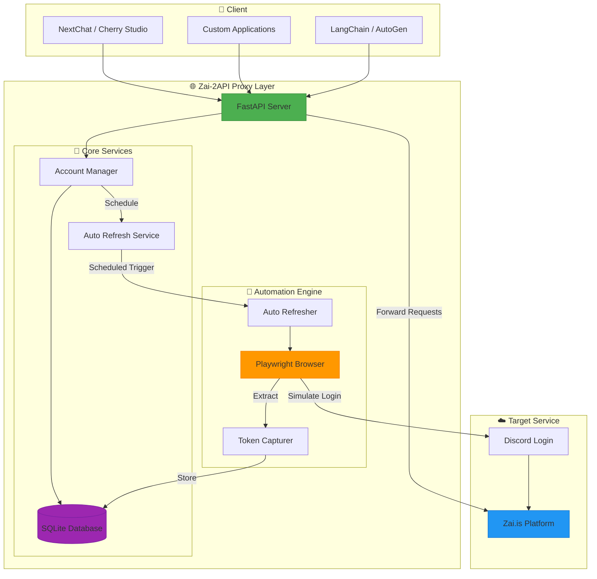
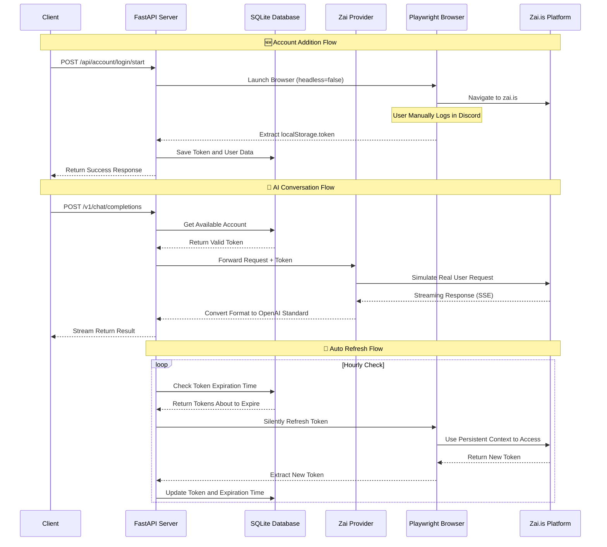
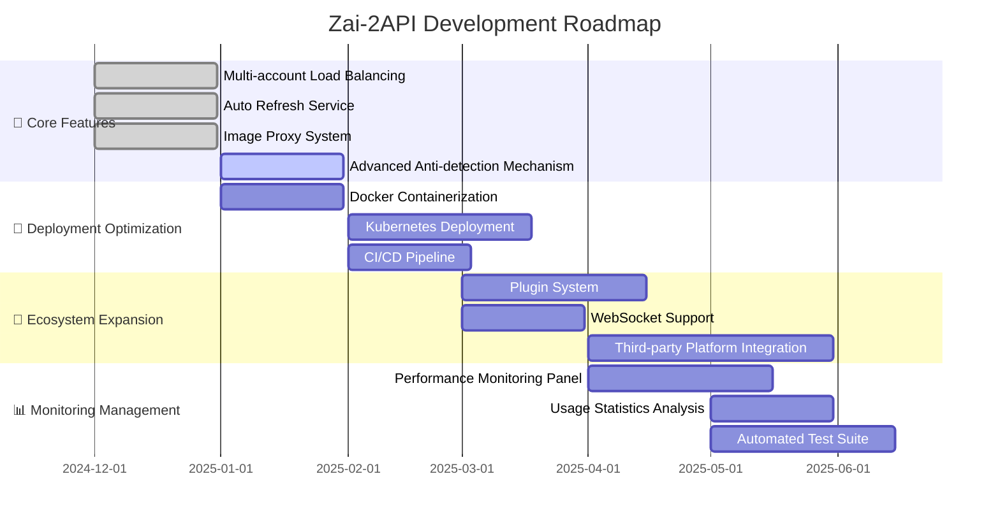

# 🚀 Zai-2API: Unlock Zai.is's Unlimited Potential (Python Version)

[](https://www.python.org/)
[](https://fastapi.tiangolo.com/)
[](https://playwright.dev/)
[](https://platform.openai.com/)
[](https://opensource.org/licenses/Apache-2.0)

> **🌐 GitHub Repository**: [https://github.com/iudd/zai.is-2api-python](https://github.com/iudd/zai.is-2api-python)

---

## 🌟 Core Features

<div align="center">

| 🔄 Auto Refresh | 🛡️ Advanced Stealth | 💾 Persistent Storage | 🖼️ Smart Image Processing |
|----------------|---------------------|----------------------|---------------------------|
| Token Auto-keep | Bypass Captcha | Login State Persist | Base64 Image Conversion |
| 7×24h Running | Remove Automation Fingerprint | Cookie Local Storage | Cross-domain Proxy Support |

</div>

---

## 📖 Introduction

Hello, Explorer! 👋

When you open this document, you're not just looking at code—you're encountering a philosophy of **"breaking down technological barriers"**. Zai-2API was born from a simple desire: **to make powerful AI models accessible to everyone, and to bring technological benefits to every individual.**

In this project, we don't create AI; we are **"bridge builders"** for AI. Using modern browser automation technology, we transform Zai.is's excellent web experience into developer-friendly API interfaces.

This is not just a tool; it's an interesting practice in **reverse engineering, automation, and system architecture**. I hope you feel the pure joy that code brings—the sense of achievement of "I came, I saw, I conquered." ✨

---

## 🏗️ System Architecture



---

## 🚀 Quick Start

### 1️⃣ Environment Preparation
Ensure your system has **Python 3.9+** installed:
```bash
python --version
# Python 3.11.0 or higher
```

### 2️⃣ Get the Project
**Method A: Git Clone (Recommended)**
```bash
git clone https://github.com/iudd/zai.is-2api-python.git
cd zai.is-2api-python
```

**Method B: Direct Download**
1. Visit [GitHub Repository](https://github.com/iudd/zai.is-2api-python)
2. Click `Code` → `Download ZIP`
3. Extract to local directory

### 3️⃣ One-Click Installation
Run in the project root directory:
```bash
# Install Python dependencies
pip install -r requirements.txt

# Install Playwright browser kernel
playwright install chromium
```

### 4️⃣ Start the Service
**Windows Users:**
- Double-click `start.bat` file
- Or run via command line: `python main.py`

**macOS/Linux Users:**
```bash
python main.py
```

### 5️⃣ Initial Configuration
1. Open browser and visit: `http://localhost:8000`
2. Click **"🌐 Launch Browser Login"** button
3. Complete Discord login in the popup browser window
4. Close browser after successful login; Token is automatically saved
5. Now you can start using the API! 🎉

---

## 📊 Technical Architecture Details

### 🧩 Core Component Description

| Component | Tech Stack | Responsibility | Key Technical Points |
|-----------|------------|----------------|---------------------|
| **Web Service Layer** | FastAPI + Uvicorn | Provide HTTP API Interface | OpenAI Compatible Interface, SSE Streaming Response |
| **Automation Layer** | Playwright + Chromium | Browser Automation Operations | Persistent Context, Anti-detection Technology |
| **Data Layer** | SQLite + Thread Lock | State Storage and Management | Thread-safe Operations, ACID Transactions |
| **Business Layer** | Custom Manager | Account, Token, Image Management | Auto Refresh, Load Balancing, Cache Cleanup |

### 🔄 Workflow


### 🛡️ Anti-detection Technology Implementation
```python
# Key Anti-detection Configuration
context = await browser.new_context(
    viewport={'width': 1920, 'height': 1080},
    user_agent='Mozilla/5.0 (Windows NT 10.0; Win64; x64) AppleWebKit/537.36',
    # Remove Automation Features
    bypass_csp=True,
    ignore_https_errors=True,
    java_script_enabled=True,
    has_touch=False,
    is_mobile=False,
    extra_http_headers={
        'Accept-Language': 'zh-CN,zh;q=0.9,en;q=0.8',
        'Sec-Ch-Ua': '"Not_A Brand";v="8", "Chromium";v="120"',
    }
)

# Inject Script to Remove WebDriver Features
await page.add_init_script("""
    Object.defineProperty(navigator, 'webdriver', { get: () => undefined });
    window.chrome = { runtime: {} };
    Object.defineProperty(navigator, 'plugins', {
        get: () => [1, 2, 3, 4, 5]
    });
""")
```

---

## 🔧 Detailed Configuration Guide

### 📁 Directory Structure Description
```
zai-2api/
├── 📁 accounts_data/     # Browser User Data (Auto-generated)
│   ├── acc_20250101_120000/
│   │   └── browser_data/  # Playwright Persistent Data
│   └── ...
├── 📁 app/               # Application Core Code
│   ├── 📁 core/          # Core Modules
│   │   ├── config.py     # Configuration Management
│   │   └── db_manager.py # Database Management (Singleton Pattern)
│   ├── 📁 providers/     # Platform Providers
│   │   └── zai_provider.py # Zai.is API Encapsulation
│   └── 📁 utils/         # Utility Classes
│       ├── token_auto_refresh_service.py # Auto Refresh Service
│       └── ...
├── 📁 data/              # SQLite Database Files
│   └── zai.db           # Main Database
├── 📁 media/             # Image Cache (Auto-cleanup)
├── 📁 templates/         # Web Interface Templates
│   └── dashboard.html   # Dashboard Interface
├── .env                 # Environment Variable Configuration
├── main.py              # FastAPI Application Entry
├── requirements.txt     # Python Dependencies
└── start.bat           # Windows Startup Script
```

### ⚙️ Environment Variable Configuration
Create or edit `.env` file:
```ini
# === Security Configuration ===
API_MASTER_KEY=your_secret_key_here  # API Access Key
PORT=8000                           # Service Port

# === Path Configuration ===
DB_PATH=data/zai.db                # Database Path
USER_DATA_DIR=zai_user_data        # User Data Directory

# === Advanced Options ===
# REFRESH_INTERVAL=3600            # Token Refresh Interval (seconds)
# PREVIEW_MODE=false               # Whether to Show Browser Window
```

---

## 📡 API Interface Documentation

### 🤖 OpenAI Compatible Interfaces
All interfaces follow **OpenAI API specifications** and can directly integrate with various AI clients.

#### Chat Completion
```http
POST /v1/chat/completions
Content-Type: application/json
Authorization: Bearer your_api_key

{
  "model": "gpt-5-2025-08-07",
  "messages": [
    {"role": "user", "content": "Hello, please introduce yourself"}
  ],
  "stream": true,
  "temperature": 0.7,
  "max_tokens": 1000
}
```

#### Get Model List
```http
GET /v1/models
```

### 🛠️ Management Interfaces

#### Launch Browser Login
```http
POST /api/account/login/start
Content-Type: application/x-www-form-urlencoded

name=My Account
```

#### Manually Add Account
```http
POST /api/account/add
Content-Type: application/x-www-form-urlencoded

name=Manual Account&token=eyJhbGciOiJIUzI1NiIs...
```

#### Force Refresh All Accounts
```http
POST /api/refresh/force
```

#### Get Account Status
```http
GET /api/account/status
```

### 🖼️ Image Processing Features
When AI returns responses containing base64 images:
```markdown
# AI Original Response


# Proxy Response

```

**Automatic Processing Flow:**
1. ✅ Detect base64 image data
2. ✅ Decode and save as PNG/JPG files
3. ✅ Replace with locally accessible URLs
4. ✅ Auto-clean after 30 minutes

---

## 🎯 Supported AI Models

Zai-2API supports all mainstream models on the Zai.is platform:

| Model ID | Display Name | Provider | Capabilities |
|----------|--------------|----------|--------------|
| `gpt-5-2025-08-07` | GPT-5 | OpenAI | Latest GPT-5 Model |
| `claude-opus-4-20250514` | Claude Opus 4 | Anthropic | Strongest Reasoning Model |
| `claude-sonnet-4-5-20250929` | Claude Sonnet 4.5 | Anthropic | Balanced Intelligent Assistant |
| `gemini-3-pro-image-preview` | Nano Banana Pro | Google | Multimodal Vision Model |
| `o3-pro-2025-06-10` | o3-pro | OpenAI | Reasoning Optimized Version |
| `grok-4-1-fast-reasoning` | Grok 4.1 Fast | xAI | Fast Reasoning Version |
| `gemini-2.5-pro` | Gemini 2.5 Pro | Google | Professional Text Processing |
| `claude-haiku-4-5-20251001` | Claude Haiku 4.5 | Anthropic | Fast Lightweight Model |
| `o1-2024-12-17` | o1 | OpenAI | Math Reasoning Specific |
| `o4-mini-2025-04-16` | o4-mini | OpenAI | Lightweight Fast Version |
| `grok-4-0709` | Grok 4 | xAI | Standard Version |
| `gemini-2.5-flash-image` | Nano Banana | Google | Fast Image Processing |

---

## 🔍 Troubleshooting

### ❌ Common Problem Solutions

| Problem | Possible Cause | Solution |
|---------|----------------|----------|
| **Browser Cannot Start** | Playwright Not Installed Correctly | Run `playwright install chromium` |
| **Cannot Get Token After Login** | Discord Login Flow Changed | Check browser console logs; may need to update selectors |
| **Token Expires Frequently** | Refresh Interval Set Improperly | Check network stability, adjust `REFRESH_INTERVAL` |
| **API Response Slow** | Network Issues or Account Limits | Use multi-account polling, check proxy settings |
| **Image Cannot Display** | Cross-domain Issues or Path Errors | Ensure client can access `http://localhost:8000/media/` |

### 📋 Debug Mode
Add debug parameters when starting service:
```bash
# Windows
set LOG_LEVEL=DEBUG && python main.py

# macOS/Linux
LOG_LEVEL=DEBUG python main.py
```

Check detailed logs to understand the problem.

---

## 📈 Performance Optimization Suggestions

### 🚀 Improve Concurrency
1. **Multi-account Polling**: Add multiple Zai.is accounts; system automatically load balances
2. **Connection Pool Optimization**: Adjust `httpx.AsyncClient` connection pool size
3. **Caching Strategy**: Cache frequently requested model information

### 💾 Resource Management
```python
# Optimize connection management in zai_provider.py
async with httpx.AsyncClient(
    timeout=120.0,
    limits=httpx.Limits(
        max_connections=100,
        max_keepalive_connections=50
    ),
    http2=True  # Enable HTTP/2
) as client:
    # Request code...
```

---

## 🔮 Future Development Roadmap



---

## 🤝 How to Contribute

We welcome contributions in various forms! 🎉

### 🐛 Report Bugs
1. Check [GitHub Issues](https://github.com/iudd/zai.is-2api-python/issues) for existing reports
2. Create new Issue with detailed reproduction steps
3. Include: environment info, error logs, expected behavior

### 💡 Feature Suggestions
1. Discuss ideas in Issues first
2. Describe use cases and expected benefits
3. If possible, provide prototype code or design ideas

### 🔧 Submit Code
1. Fork this repository
2. Create feature branch: `git checkout -b feature/amazing-feature`
3. Commit changes: `git commit -m 'Add amazing feature'`
4. Push to branch: `git push origin feature/amazing-feature`
5. Create Pull Request

### 📚 Improve Documentation
- Fix spelling or grammar issues
- Add usage examples
- Translate to other languages
- Add charts or diagrams

---

## ⚖️ Legal and Ethical Statement

### 📜 License
This project uses **Apache License 2.0** open source license.

**You Can:**
- ✅ Freely use, copy, and modify this software
- ✅ Use for personal, commercial, or educational purposes
- ✅ Distribute modified versions
- ✅ Apply for patent license

**You Need To:**
- 📝 Retain original copyright and license notices
- ⚖️ Clearly indicate changes in modified files
- 📄 Include Apache 2.0 license copy when distributing

### 🛡️ Ethical Usage Guide
**Please:**
- 🔒 Only use for legitimate authorized research and learning purposes
- 👥 Respect the target platform's terms of service
- 📊 Reasonably control request frequency to avoid burdening target servers
- 🤝 Respect rights of other users and developers

**Please Do Not:**
- 🚫 Use for any illegal or unethical activities
- 🚫 Large-scale爬取 or commercial abuse
- 🚫 Attack or damage target services
- 🚫 Infringe on others' intellectual property rights

### ⚠️ Disclaimer
This project is for **technical research and learning exchange** only. Users are fully responsible for their own actions. Developers are not responsible for any direct or indirect losses arising from the use of this project.

> **Technology itself is neutral, but the use of technology should have boundaries. Let's work together to maintain a healthy and legal technology ecosystem.** 🌱

---

## 🌟 Special Thanks

- **Zai.is Team** - Providing excellent AI platform
- **Playwright Community** - Powerful browser automation tool
- **FastAPI Project** - High-performance web framework
- **All Contributors** - Making this project better
- **Open Source Spirit** - Code changes the world, sharing creates value

---

## 📞 Support and Communication

Having problems or suggestions? We provide multiple support channels:

| Channel | Purpose | Response Time |
|---------|---------|---------------|
| [GitHub Issues](https://github.com/iudd/zai.is-2api-python/issues) | Bug Reports, Feature Suggestions | 1-3 Days |
| GitHub Discussions | Technical Discussions, Usage Exchange | 1-2 Days |
| Project Wiki | Detailed Documentation, Tutorials | Continuous Updates |
| Discord Community | Real-time Communication, Quick Help | Instant |

---

## 📊 Project Statistics

<div align="center">


**Last Updated:** 2025年12月11日 23:00:24
**Active Status:** 🟢 Actively Maintained
**Recommended Python Version:** 3.11+

</div>

---

> **💖 Made with passion and countless cups of coffee by [iudd](https://github.com/iudd)**
> *If this project helps you, please give it a ⭐ on GitHub!*

---

<div align="center">
  
**✨ Technology Freedom Begins with Sharing ✨**

</div>
